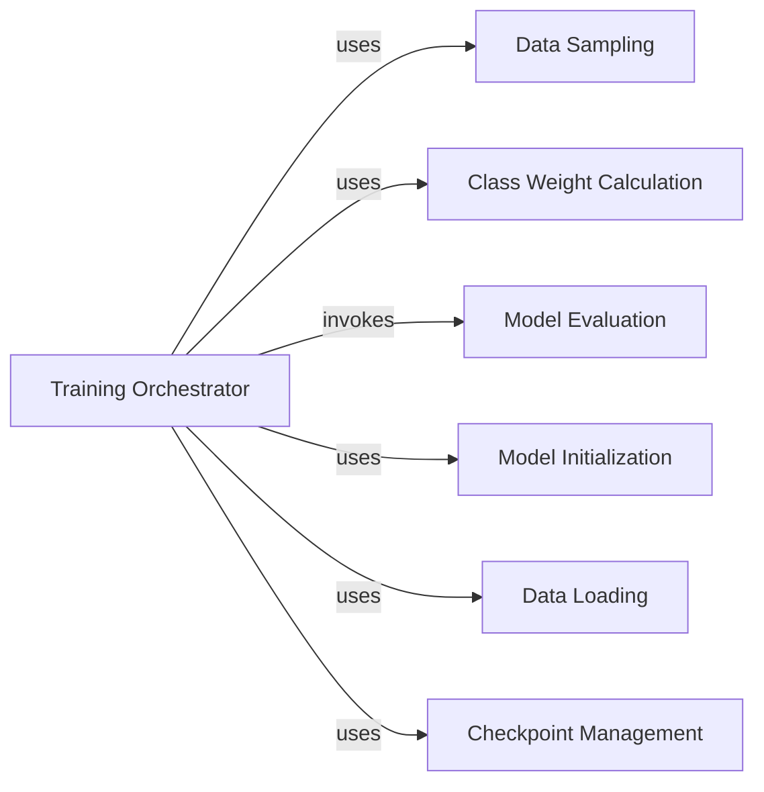

## Component Details

The Model Training component orchestrates the entire training lifecycle of the NeuSomatic model. It begins by loading and preprocessing candidate data, ensuring class balance through custom sampling and weight calculation. The core training loop then initializes and optimizes the neural network, periodically evaluating its performance on a validation set. Checkpoint management is integrated to save and restore the model's state, ensuring training progress can be resumed or deployed.

### Training Orchestrator

This component is responsible for orchestrating the entire training process of the NeuSomatic network. It handles data loading, model initialization, checkpoint management, training loop execution, loss calculation, optimization, and periodic evaluation.

**Related Classes/Methods**:

- <a href="https://github.com/bioinform/neusomatic/blob/master/neusomatic/python/train.py#L195-L486" target="_blank" rel="noopener noreferrer">`neusomatic.neusomatic.python.train.train_neusomatic` (195:486)</a>

### Data Sampling

This component provides a custom sampler for creating balanced mini-batches during training, specifically addressing the imbalance between 'none' (non-somatic) and 'variant' (somatic) candidates. It ensures that a controlled number of 'none' samples are included in each batch.

**Related Classes/Methods**:

- <a href="https://github.com/bioinform/neusomatic/blob/master/neusomatic/python/train.py#L165-L192" target="_blank" rel="noopener noreferrer">`neusomatic.neusomatic.python.train.SubsetNoneSampler` (165:192)</a>

### Class Weight Calculation

This component calculates inverse frequency weights for different classes (variant types and lengths) to address class imbalance during training. These weights are then used in the loss function to give more importance to under-represented classes.

**Related Classes/Methods**:

- <a href="https://github.com/bioinform/neusomatic/blob/master/neusomatic/python/train.py#L42-L72" target="_blank" rel="noopener noreferrer">`neusomatic.neusomatic.python.train.make_weights_for_balanced_classes` (42:72)</a>

### Model Evaluation

This component is responsible for evaluating the trained NeuSomatic model on a validation dataset. It calculates and logs various accuracy metrics for both variant type and length predictions, providing insights into the model's performance.

**Related Classes/Methods**:

- <a href="https://github.com/bioinform/neusomatic/blob/master/neusomatic/python/train.py#L75-L162" target="_blank" rel="noopener noreferrer">`neusomatic.neusomatic.python.train.test` (75:162)</a>

### Model Initialization

This component is responsible for initializing the NeuSomatic neural network model, setting up its architecture based on whether it's an ensemble or standalone model, and configuring it for CPU or GPU training.

**Related Classes/Methods**:

- <a href="https://github.com/bioinform/neusomatic/blob/master/neusomatic/python/network.py#L38-L77" target="_blank" rel="noopener noreferrer">`neusomatic.neusomatic.python.network.NeuSomaticNet` (38:77)</a>

### Data Loading

This component handles the loading and preprocessing of candidate data for training and validation. It uses the NeuSomaticDataset to manage data access, transformations, and filtering based on coverage thresholds.

**Related Classes/Methods**:

- <a href="https://github.com/bioinform/neusomatic/blob/master/neusomatic/python/dataloader.py#L125-L425" target="_blank" rel="noopener noreferrer">`neusomatic.neusomatic.python.dataloader.NeuSomaticDataset` (125:425)</a>

### Checkpoint Management

This component manages the saving and loading of model checkpoints during the training process. It ensures that the model's state, training epoch, and other relevant parameters can be persisted and restored.

**Related Classes/Methods**:

- `torch.save` (full file reference)

- `torch.load` (full file reference)

### [FAQ](https://github.com/CodeBoarding/GeneratedOnBoardings/tree/main?tab=readme-ov-file#faq)