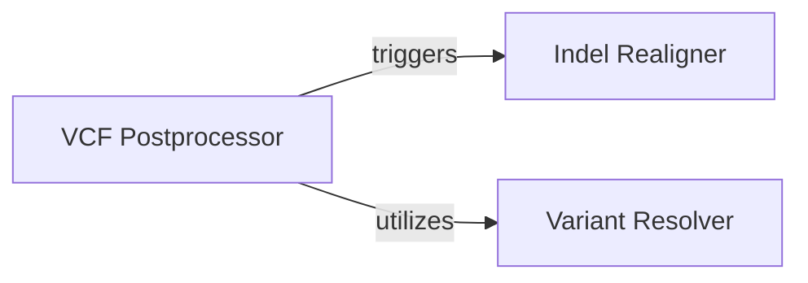

## Component Details

The Output Post-processing subsystem manages the final stages of variant call refinement and output generation. It orchestrates complex variant resolution, merges VCFs, and adds supplementary information to produce the final, high-quality VCF output. This involves indel realignment for long reads, resolving specific variant types like deletions and insertions, and comprehensive post-processing of VCF files to enrich them with relevant data.

### Indel Realigner

This component is responsible for performing indel realignment on long-read sequencing data. It extends genomic regions to capture repeat sequences and corrects BAM files in parallel to reflect the realigned indels.

**Related Classes/Methods**:

- <a href="https://github.com/bioinform/neusomatic/blob/master/neusomatic/python/long_read_indelrealign.py#L1166-L1280" target="_blank" rel="noopener noreferrer">`neusomatic.neusomatic.python.long_read_indelrealign.long_read_indelrealign` (1166:1280)</a>

- <a href="https://github.com/bioinform/neusomatic/blob/master/neusomatic/python/long_read_indelrealign.py#L1067-L1163" target="_blank" rel="noopener noreferrer">`neusomatic.neusomatic.python.long_read_indelrealign.extend_regions_repeat` (1067:1163)</a>

- <a href="https://github.com/bioinform/neusomatic/blob/master/neusomatic/python/long_read_indelrealign.py#L752-L794" target="_blank" rel="noopener noreferrer">`neusomatic.neusomatic.python.long_read_indelrealign.parallel_correct_bam` (752:794)</a>

### Variant Resolver

This component identifies and extracts resolved variants, specifically focusing on deletions (DEL) and insertions (INS) from alignment records. It processes CIGAR strings to pinpoint these variant types.

**Related Classes/Methods**:

- <a href="https://github.com/bioinform/neusomatic/blob/master/neusomatic/python/resolve_variants.py#L72-L148" target="_blank" rel="noopener noreferrer">`neusomatic.neusomatic.python.resolve_variants.find_resolved_variants` (72:148)</a>

- <a href="https://github.com/bioinform/neusomatic/blob/master/neusomatic/python/resolve_variants.py#L36-L47" target="_blank" rel="noopener noreferrer">`neusomatic.neusomatic.python.resolve_variants.extract_del` (36:47)</a>

- <a href="https://github.com/bioinform/neusomatic/blob/master/neusomatic/python/resolve_variants.py#L50-L69" target="_blank" rel="noopener noreferrer">`neusomatic.neusomatic.python.resolve_variants.extract_ins` (50:69)</a>

### VCF Postprocessor

This component performs post-processing on VCF files, including merging predicted variants, resolving targets, and adding comprehensive VCF information such as scores, depth, and allele frequencies. It orchestrates the overall post-processing workflow.

**Related Classes/Methods**:

- <a href="https://github.com/bioinform/neusomatic/blob/master/neusomatic/python/postprocess.py#L150-L223" target="_blank" rel="noopener noreferrer">`neusomatic.neusomatic.python.postprocess.postprocess` (150:223)</a>

- <a href="https://github.com/bioinform/neusomatic/blob/master/neusomatic/python/postprocess.py#L29-L147" target="_blank" rel="noopener noreferrer">`neusomatic.neusomatic.python.postprocess.add_vcf_info` (29:147)</a>

### [FAQ](https://github.com/CodeBoarding/GeneratedOnBoardings/tree/main?tab=readme-ov-file#faq)