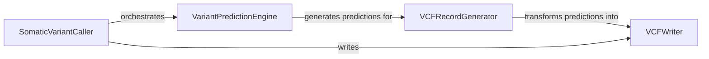

## Component Details

This system orchestrates the entire somatic mutation calling process using the NeuSomatic model. It begins by initializing the neural network and loading pre-trained weights. It then manages input candidate files, splitting large ones for efficient processing. The core flow involves a Variant Prediction Engine that applies the model to generate raw predictions. These predictions are subsequently transformed into structured VCF records by the VCF Record Generator, which are then written to output VCF files by the VCF Writer, handling both somatic and non-somatic variants and applying filtering thresholds.

### SomaticVariantCaller

This component orchestrates the entire somatic mutation calling process. It initializes the neural network model, loads pre-trained weights, manages input candidate files, splits large files for efficient processing, and coordinates the prediction and VCF output generation steps. It handles logging and directory management for intermediate and final outputs.

**Related Classes/Methods**:

- <a href="https://github.com/bioinform/neusomatic/blob/master/neusomatic/python/call.py#L389-L561" target="_blank" rel="noopener noreferrer">`neusomatic.python.call.call_neusomatic` (389:561)</a>

### VariantPredictionEngine

This component is responsible for performing the actual variant prediction using the loaded neural network model. It processes batches of candidate data, applies the model, and generates raw predictions for somatic and non-somatic variants.

**Related Classes/Methods**:

- <a href="https://github.com/bioinform/neusomatic/blob/master/neusomatic/python/call.py#L53-L117" target="_blank" rel="noopener noreferrer">`neusomatic.python.call.call_variants` (53:117)</a>

### VCFRecordGenerator

This component transforms the raw predictions from the variant prediction engine into structured VCF (Variant Call Format) records. It handles both somatic and non-somatic predictions, mapping them to appropriate VCF entries based on reference genome information and variant classifications.

**Related Classes/Methods**:

- <a href="https://github.com/bioinform/neusomatic/blob/master/neusomatic/python/call.py#L307-L332" target="_blank" rel="noopener noreferrer">`neusomatic.python.call.pred_vcf_records` (307:332)</a>

- <a href="https://github.com/bioinform/neusomatic/blob/master/neusomatic/python/call.py#L335-L353" target="_blank" rel="noopener noreferrer">`neusomatic.python.call.pred_vcf_records_none` (335:353)</a>

- <a href="https://github.com/bioinform/neusomatic/blob/master/neusomatic/python/call.py#L356-L362" target="_blank" rel="noopener noreferrer">`neusomatic.python.call.get_vcf_records` (356:362)</a>

### VCFWriter

This component is responsible for writing the generated VCF records to output files. It takes the processed VCF records, applies filtering thresholds (pass/lowqual), and formats them according to VCF specifications, ensuring proper chromosome ordering.

**Related Classes/Methods**:

- <a href="https://github.com/bioinform/neusomatic/blob/master/neusomatic/python/call.py#L365-L386" target="_blank" rel="noopener noreferrer">`neusomatic.python.call.write_vcf` (365:386)</a>

### [FAQ](https://github.com/CodeBoarding/GeneratedOnBoardings/tree/main?tab=readme-ov-file#faq)