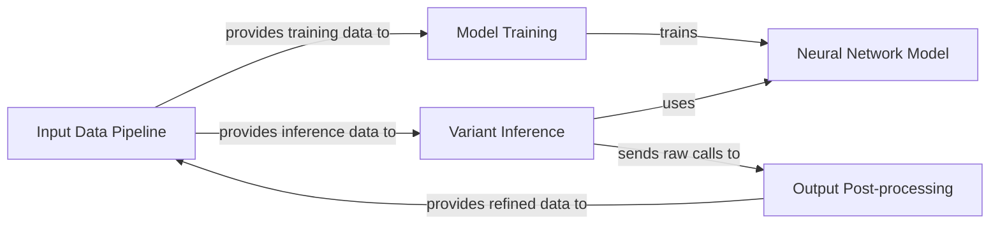

## Component Details

The NeuSomatic architecture is designed for somatic variant calling, primarily focusing on long-read sequencing data. The main flow involves an Input Data Pipeline that prepares and loads genomic data, which then feeds into either Model Training to train the Neural Network Model, or directly into Variant Inference for prediction. The Variant Inference component generates initial variant calls, which are then refined and finalized by the Output Post-processing component. A notable aspect is the feedback loop from Output Post-processing back to the Input Data Pipeline, suggesting iterative refinement or specialized data preparation based on initial variant analysis, particularly for indel realignment.

### Input Data Pipeline

Manages the entire process of preparing raw input data, generating structured datasets, and loading them efficiently for both model training and inference. This includes initial data preprocessing, dataset creation from various genomic sources, and batching for the neural network.

**Related Classes/Methods**:

- <a href="https://github.com/bioinform/neusomatic/blob/master/neusomatic/python/preprocess.py#L198-L339" target="_blank" rel="noopener noreferrer">`neusomatic.neusomatic.python.preprocess.preprocess` (198:339)</a>

- <a href="https://github.com/bioinform/neusomatic/blob/master/neusomatic/python/generate_dataset.py#L1401-L1593" target="_blank" rel="noopener noreferrer">`neusomatic.neusomatic.python.generate_dataset.generate_dataset` (1401:1593)</a>

- <a href="https://github.com/bioinform/neusomatic/blob/master/neusomatic/python/dataloader.py#L125-L425" target="_blank" rel="noopener noreferrer">`neusomatic.neusomatic.python.dataloader.NeuSomaticDataset` (125:425)</a>

### Neural Network Model

Defines the core convolutional neural network architecture (NeuSomaticNet) used by NeuSomatic for variant prediction. It encompasses the network's layers, building blocks, and the forward pass computation.

**Related Classes/Methods**:

- <a href="https://github.com/bioinform/neusomatic/blob/master/neusomatic/python/network.py#L38-L77" target="_blank" rel="noopener noreferrer">`neusomatic.neusomatic.python.network.NeuSomaticNet` (38:77)</a>

### Model Training

Handles the training lifecycle of the NeuSomatic model. This includes initializing the neural network, loading training data, balancing classes, defining loss functions, optimizing the model parameters, and evaluating its performance.

**Related Classes/Methods**:

- <a href="https://github.com/bioinform/neusomatic/blob/master/neusomatic/python/train.py#L195-L486" target="_blank" rel="noopener noreferrer">`neusomatic.neusomatic.python.train.train_neusomatic` (195:486)</a>

### Variant Inference

Executes the core variant calling process by applying the trained NeuSomatic model to prepared input data. It performs inference and generates initial VCF records based on the model's predictions.

**Related Classes/Methods**:

- <a href="https://github.com/bioinform/neusomatic/blob/master/neusomatic/python/call.py#L53-L117" target="_blank" rel="noopener noreferrer">`neusomatic.neusomatic.python.call.call_variants` (53:117)</a>

### Output Post-processing

Manages the final stages of variant call refinement and output generation. This component orchestrates complex variant resolution (e.g., for short reads or long-read indels), merges VCFs, and adds supplementary information to produce the final, high-quality VCF output.

**Related Classes/Methods**:

- <a href="https://github.com/bioinform/neusomatic/blob/master/neusomatic/python/resolve_variants.py#L72-L148" target="_blank" rel="noopener noreferrer">`neusomatic.neusomatic.python.resolve_variants.find_resolved_variants` (72:148)</a>

- <a href="https://github.com/bioinform/neusomatic/blob/master/neusomatic/python/long_read_indelrealign.py#L1166-L1280" target="_blank" rel="noopener noreferrer">`neusomatic.neusomatic.python.long_read_indelrealign.long_read_indelrealign` (1166:1280)</a>

- <a href="https://github.com/bioinform/neusomatic/blob/master/neusomatic/python/postprocess.py#L150-L223" target="_blank" rel="noopener noreferrer">`neusomatic.neusomatic.python.postprocess.postprocess` (150:223)</a>

### [FAQ](https://github.com/CodeBoarding/GeneratedOnBoardings/tree/main?tab=readme-ov-file#faq)